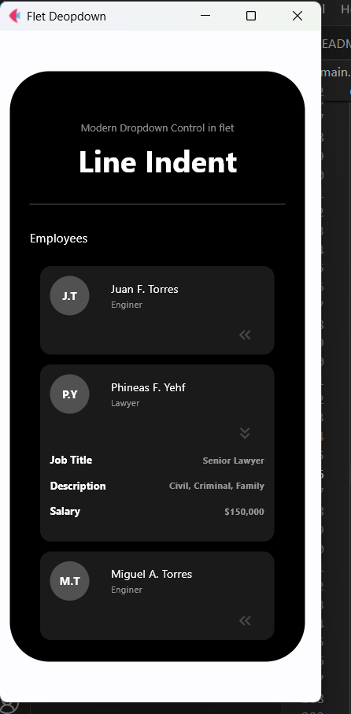

# Dropdown

This repository is an exciting example of how to use the powerful Flet library! I am currently involved in the creation of a school project. Despite having extensive documentation and examples of Flet, I sometimes encounter obstacles that I need to overcome, such as how to implement a fluid scroll, how to collapse a widget effectively, how to make only one section change view without affecting the rest?

During my walkthrough, I came across these fascinating videos:

1) [Python GUI Tutorial: Expanding Containers](https://www.youtube.com/watch?v=AvllPHXRI28).
2) [Flet Tutorial - Creating Infinite Scrolling](https://www.youtube.com/watch?v=Zx4m5-m8Fs4).

These resources have been useful to enrich my knowledge. In this repository, I have implemented the concepts of the first one and I have taken advantage of the teachings of the second one to optimise my code!


## Run application

```
pip install flet
flet run
```

## Sample of the final result 

